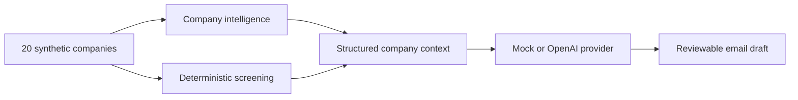

# PE Labs

Interactive demonstrations of applied AI workflows for private equity. The application links company intelligence, transparent investment screening and relationship drafting through one synthetic company universe.

All organisations, people, domains and metrics are fictional. Outputs are illustrative and are not investment advice.

## Product

- **Company intelligence:** search twenty synthetic European technology companies and inspect a concise investment profile.
- **Investment screening:** apply five qualification gates and an explicit ten-point rubric with field-level rationales.
- **Relationship drafting:** turn structured company context and a specific angle into concise outreach through a swappable provider interface.



## Design principles

1. **Inspectable over impressive:** qualification gates, scores and draft context are visible to the reviewer.
2. **Deterministic where possible:** screening is ordinary code, not an unnecessary model call.
3. **Safe by default:** the default deployment needs no database, model credentials or paid API.
4. **Provider boundaries:** drafting output is schema-validated and the mock implementation can be replaced server-side.
5. **Honest provenance:** the interface labels synthetic data and mock output explicitly.

## Run locally

Requires Node.js 20.9 or later and npm.

```bash
npm install
```

```bash
npm run dev
```

Open [http://localhost:3000](http://localhost:3000).

## Verification

```bash
npm run check
```

This runs Biome, TypeScript, Vitest and a production Next.js build.

## Deployment

The default `mock` provider is suitable for a credential-free Vercel deployment. No environment variables are required.

To activate live drafting safely:

1. Deploy and verify the mock configuration first.
2. In Vercel Firewall, add an IP-based rate-limit rule for path `/api/draft`: five requests per ten minutes, respond with `429`.
3. In the OpenAI project, set a deliberately low monthly budget and usage alert.
4. Add these Production environment variables in Vercel:

   ```text
   DRAFT_PROVIDER=openai
   OPENAI_API_KEY=<project key>
   OPENAI_MODEL=gpt-5.5
   ```

5. Redeploy and exercise one live draft. The UI should report the model and prompt version beneath the structured context.

The OpenAI adapter runs only in a server route, uses the Responses API with Structured Outputs, limits retries and execution time, validates output with Zod and retains the deterministic mock as the default. Never add the API key to GitHub Secrets or a `NEXT_PUBLIC_` variable.

## Stack

- Next.js 16 and React 19
- TypeScript
- Tailwind CSS 4 with a custom semantic design layer
- Zod for API contracts
- Vitest for deterministic domain tests
- Biome for linting and formatting
