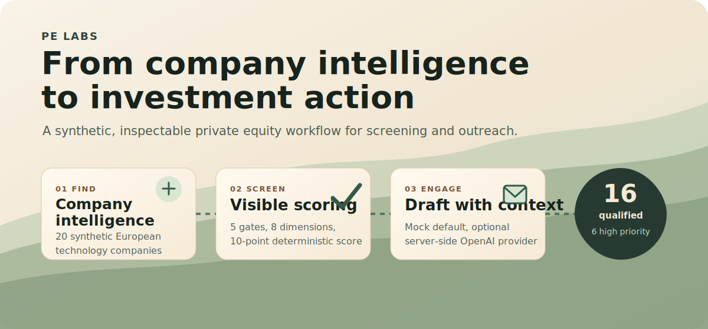
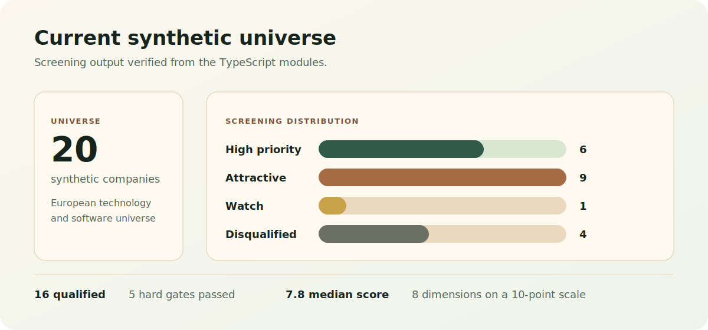
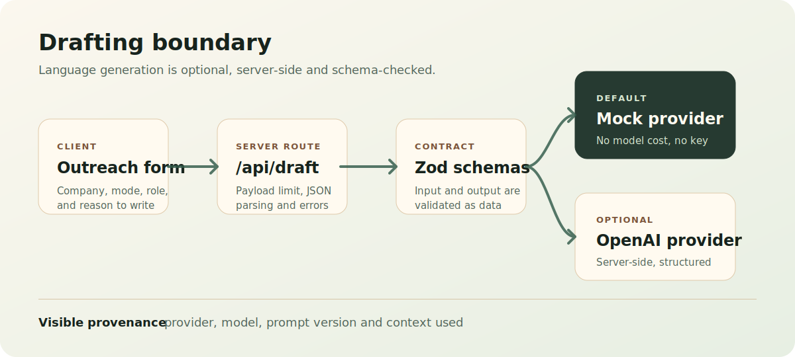

# PE Labs



[](https://pe-labs.vercel.app)
[](https://nextjs.org)
[](https://react.dev)
[](https://www.typescriptlang.org)
[](#generation-boundary)

PE Labs is a working portfolio demo for prototype AI workflows in company intelligence, thematic screening and relationship-led origination. It links a synthetic European company universe, transparent investment screening and relationship drafting in one clean product flow.

The point is not to pretend this is an investment platform. The point is to show how PE workflows can be made more useful when the deterministic parts stay deterministic, the model boundary is explicit, and every output carries enough context to be reviewed.

All organisations, people, domains and metrics are fictional. Nothing here is investment advice.

**Live:** [pe-labs.vercel.app](https://pe-labs.vercel.app)

## At a glance

| Area | What it does | Why it matters |
|---|---|---|
| Company intelligence | Search and inspect 20 synthetic European technology businesses | Turns scattered company facts into a compact investment profile |
| Investment screening | Applies 5 hard gates and an 8-dimension, 10-point score | Keeps the qualification logic visible and repeatable |
| Relationship drafting | Converts structured context plus one clear angle into concise outreach | Uses AI only where language generation is useful |
| Provider boundary | Defaults to deterministic mock output, with optional server-side OpenAI drafting | Keeps the public demo free to run and safe by default |

## What you can try

1. Open the [company universe](https://pe-labs.vercel.app/companies) and search for a synthetic business such as Alder & Pine Systems.
2. Open the [screening view](https://pe-labs.vercel.app/screening) and compare ranked companies by score, country, sector and tier.
3. Open [relationship drafting](https://pe-labs.vercel.app/outreach), choose a company and draft type, then give the system one specific reason to write.
4. Inspect the context used beneath the draft. The output is designed to be reviewed, not trusted blindly.

## Core workflow

```text
Synthetic company universe
        |
        v
+------------------------+      +--------------------------+
| Company intelligence   | ---> | Structured company view  |
+------------------------+      +--------------------------+
        |                                   |
        v                                   v
+------------------------+      +--------------------------+
| Deterministic screen   | ---> | Score, tier, rationales  |
+------------------------+      +--------------------------+
                                            |
                                            v
                              +----------------------------+
                              | Drafting provider boundary |
                              +----------------------------+
                                | mock default | OpenAI opt-in
                                v
                              Reviewable outreach draft
```

The app deliberately separates judgement support from generation. Screening is ordinary TypeScript. Drafting is behind a provider interface and returns schema-validated output.

## Demo universe



The current dataset contains 20 fictional European companies across vertical software, fintech, climate technology, cybersecurity, data infrastructure, consumer technology and tech-enabled services.

| Region | Companies |
|---|---:|
| UK & Ireland | 4 |
| DACH | 4 |
| Benelux | 3 |
| Nordics | 3 |
| Southern Europe | 3 |
| France | 2 |
| Central Europe | 1 |

Each organisation includes enough structured context to support search, screening and drafting:

| Category | Example fields |
|---|---|
| Identity | Name, synthetic domain, city, country, region |
| Market | Sector, sub-sector, business model, ownership |
| Scale | Revenue, EBITDA, employees, founded year |
| Momentum | Revenue growth, employee growth, international revenue |
| Quality | Recurring revenue, customer concentration, confidence |
| Review context | Description, thesis points, risks, recent signals |

## Screening model

The screening layer is intentionally plain. It avoids an LLM call because there is no need for one.

**Qualification gates**

| Gate | Pass condition |
|---|---|
| Primarily B2B | The business sells mainly to business customers |
| EUR1m to EUR20m EBITDA | The business sits inside the illustrative platform range |
| Privately held | Listed companies are stopped before scoring |
| European presence | The business has a European operating base |
| No recent change of control | Recently acquired businesses are deprioritised |

**Scoring dimensions**

| Dimension | Max points | What it captures |
|---|---:|---|
| Revenue quality | 2.00 | Recurring revenue visibility |
| Scale | 1.50 | EBITDA fit for the illustrative platform range |
| Growth | 1.50 | Revenue growth momentum |
| Profitability | 1.50 | EBITDA margin and operating leverage |
| Market focus | 1.25 | Specificity of the niche |
| Product depth | 1.00 | Workflow depth and defensibility |
| Internationalisation | 0.75 | Cross-border repeatability |
| Dealability | 0.50 | Ownership route and likely process complexity |

Verified from the current TypeScript modules:

| Metric | Current value |
|---|---:|
| Companies | 20 |
| Qualified | 16 |
| High priority | 6 |
| Attractive | 9 |
| Watch | 1 |
| Disqualified | 4 |
| Median qualified score | 7.8 |

Top-ranked examples in the current universe are Alder & Pine Systems, Mossvale Software and Cedar Ledger. They are fictional, but the flow is representative: a reviewer can see the score, the gates, each dimension and the rationale behind the recommendation.

## Generation boundary



Relationship drafting takes structured company context, a draft mode, a recipient role and one explicit angle. The public deployment defaults to a deterministic mock provider, so it has no model cost and needs no API key.

The optional OpenAI provider runs only in the server route. It uses the Responses API with structured output validation, low retry count, request size limits and no browser-exposed credentials.

```ts
type DraftInput = {
  organisationSlug: string;
  recipientFirstName: string;
  recipientRole?: string;
  mode: "first-touch" | "re-engagement" | "follow-up" | "event-invite";
  angle: string;
};

type DraftOutput = {
  subject: string;
  body: string;
  provider: "mock-v1" | "openai";
  model: string;
  promptVersion: string;
  contextUsed: string[];
};
```

This is the main engineering idea in the repo: treat generated language as data, keep the contract narrow, and make provenance visible to the reviewer.

## Practical use cases

**Origination triage**

A user can filter the synthetic universe to a focused sector, review the companies that pass the gates, then work down from the highest-ranked opportunities. The useful part is not the score by itself. It is the visible explanation of why a company did or did not pass.

**Investment committee prep**

A reviewer can open a company profile and see the thesis, risks, signals, qualification gates and dimension-level scoring in one place. This is a compact pattern for turning structured enrichment into a first investment view.

**Relationship drafting**

A user can turn a specific angle, such as international expansion or product focus, into a concise first-touch email. The draft shows which company facts were used, so the reviewer can decide whether the outreach is grounded enough to send.

**AI architecture reference**

The repo shows a practical split between deterministic software and model-backed generation. Screening, ranking and routing are code. Language generation is optional, server-side and schema-checked.

## Example flow

```text
Company: Alder & Pine Systems
Signal: 86% recurring revenue, 18% growth, Benelux expansion
Screen: High priority, 9.2 / 10
Angle: International growth without losing product focus
Draft: Concise first-touch email with visible context used
```

The example is synthetic, but the workflow mirrors a real operating pattern: identify a reason to care, make the logic inspectable, then create the next useful action.

## Design principles

1. **Inspectable over impressive.** Gates, scores, rationales and draft context are visible.
2. **Deterministic where possible.** Screening is code, not an unnecessary model call.
3. **Safe by default.** The public demo runs without a database, API key or paid provider.
4. **Provider boundaries.** Drafting can switch from mock output to OpenAI without moving credentials client-side.
5. **Honest provenance.** Synthetic data, mock output and live model output are labelled clearly.

## Repository map

```text
src/app/                         Next.js app routes and API route
src/app/api/draft/route.ts        Draft generation endpoint
src/components/                   Product UI components
src/data/organisations.ts         Synthetic company universe
src/lib/scoring.ts                Deterministic screening model
src/lib/drafting/                 Provider interface, schemas and adapters
docs/assets/readme/               README visuals
```

## Stack

- Next.js 16 and React 19
- TypeScript
- Tailwind CSS 4 with a custom semantic design layer
- Zod for API contracts
- Vitest for deterministic domain tests
- Biome for linting and formatting
- Optional OpenAI Responses API adapter for server-side drafting

## Run locally

Requires Node.js 20.9 or later and npm.

```bash
npm install
```

```bash
npm run dev
```

Open [http://localhost:3000](http://localhost:3000).

## Verification

```bash
npm run check
```

This runs Biome, TypeScript, Vitest and a production Next.js build.

## Deployment

The default `mock` provider is suitable for a credential-free Vercel deployment. No environment variables are required.

To activate live drafting safely:

1. Deploy and verify the mock configuration first.
2. In Vercel Firewall, add an IP-based rate-limit rule for `/api/draft`, for example five requests per ten minutes with a `429` response.
3. In the OpenAI project, set a deliberately low monthly budget and usage alert.
4. Add these Production environment variables in Vercel:

   ```text
   DRAFT_PROVIDER=openai
   OPENAI_API_KEY=<project key>
   OPENAI_MODEL=gpt-5.5
   ```

5. Redeploy and exercise one live draft. The UI should show the model and prompt version beneath the structured context.

Never add the API key to GitHub Secrets for this repo and never expose it through a `NEXT_PUBLIC_` variable.

## Safety notes

- The dataset is synthetic and intentionally limited.
- The app does not provide investment advice.
- The public deployment should stay on the mock provider unless live generation is deliberately enabled.
- The OpenAI adapter is server-side, schema-validated and optional.
- Prompt, schema, provider and output provenance are versioned in code.

## Good next iterations

- Add a second synthetic universe focused on founder-owned healthcare and industrial software.
- Add saved screen definitions so different theses can be compared.
- Add exportable IC note drafts generated from the visible screening result.
- Add lightweight eval fixtures for outreach quality, groundedness and tone.
- Add a read-only audit view showing request shape, provider, prompt version and context used.
